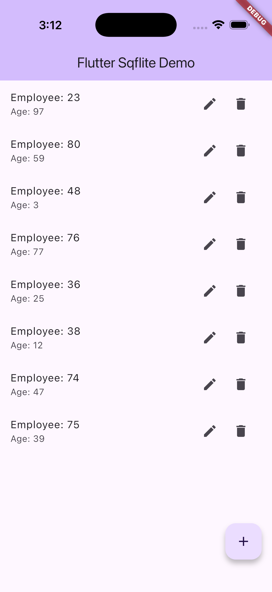

# Flutter Sqflite Demo App

A simple **Flutter** application demonstrating CRUD (Create, Read, Update, Delete) operations using **Sqflite**, a SQLite plugin for Flutter.

This app allows you to **add, update, and delete employees** with a random age and name.

---

## Features

- Add a new employee with a random name and age.
- Update an employee's name.
- Delete an employee.
- Persistent local storage using SQLite (`sqflite`).
- Simple and clean UI using Flutter Material widgets.

---

## Screenshots

### Home Screen (No Employees)


### Employee List



---

## Getting Started

### Prerequisites

- Flutter SDK >= 3.35.4
- Dart SDK >= 3.0.0
- Android Studio or VS Code

---

### Installation

1. Clone the repository:

```bash
git clone https://github.com/yourusername/flutter_sqflite_sample.git
cd flutter_sqflite_sample
```

2. Install Dependencies:

```bash
flutter pub get
```

3. Run the app:

```bash
flutter run
```


### Project Structure

```bash
lib/
├── main.dart          # Main application file
├── employee.dart      # Employee model
├── database_helper.dart # Sqflite database helper class
```